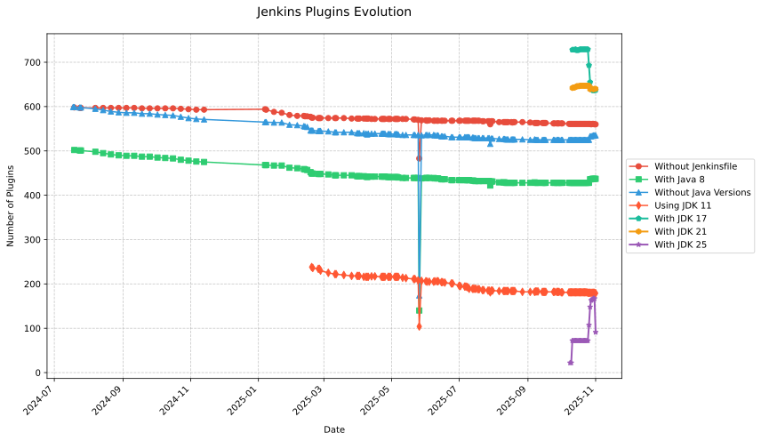

# Jenkins Plugin Modernization Pipeline

This project is a comprehensive analysis and automation system designed to modernize Jenkins plugins by migrating them from JDK 8 to JDK 11+. It analyzes all repositories under the `jenkinsci` organization on GitHub, applies OpenRewrite modernization recipes, tracks pull request evolution, and generates detailed reports on the Jenkins plugin ecosystem's Java version adoption.

## Key Features

- **Repository Discovery**: Automated discovery and analysis of Jenkins plugin repositories
- **Java Version Analysis**: Checks pom.xml files and Jenkinsfiles for Java version declarations
- **Automated Modernization**: Applies OpenRewrite recipes to migrate plugins from JDK 8 to 11+
- **Pull Request Tracking**: Collects and analyzes PR data related to modernization efforts
- **Evolution Monitoring**: Tracks the progress of Java version adoption across the Jenkins ecosystem
- **Data Visualization**: Generates charts and uploads results to Google Sheets for analysis
- **Docker Pipeline**: Fully containerized workflow with health checks and orchestration

## Requirements

### Core Tools
- **Docker & Docker Compose** (recommended) - For containerized execution
- **Bash** - Shell scripting environment
- **Git** - Version control operations
- **GitHub CLI (`gh`)** - GitHub API interactions, repository forking, and operations
- **jq** - JSON processing
- **parallel** (GNU parallel) - Concurrent script execution
- **xmlstarlet** - XML parsing for pom.xml analysis
- **xsltproc** - XSLT processor for XML namespace removal

### Programming Languages
- **Go 1.23.2+** - For Jenkins PR collector tool
- **Python 3.11+** - For data analysis and visualization
- **Java/Maven** - For plugin build verification

### Python Dependencies
Install required packages for data analysis and Google Sheets integration:
```bash
pip install -r requirements.txt
```

This installs:
- **pandas** & **matplotlib** - Data analysis and visualization
- **gspread** - Google Sheets API integration
- **google-auth** - Service account authentication support for gspread
- **openpyxl** - Excel file reading for JDK 25 tracking validation

Or for development with a virtual environment:
```bash
python -m venv venv
source venv/bin/activate  # On Windows: venv\Scripts\activate
pip install -r requirements.txt
```

### Go Dependencies
```bash
go mod tidy
```

### Environment Variables
- `GITHUB_TOKEN` - GitHub token (PAT for local runs; in CI the built-in Actions GITHUB_TOKEN is used; ensure permissions match your workflow)
- `START_DATE` - Start date for PR collection in YYYY-MM-DD format (optional, defaults to 2024-08-01)
- `RATE_LIMIT_DELAY` - Delay between API calls in seconds (optional, defaults to 2)
- `DEBUG_MODE` - Enable debug output when set to "true" (optional)
- `JDK25_SPREADSHEET_ID` - Google Spreadsheet ID for JDK 25 tracking (optional, defaults to 1pNHWUuTx4eebJ8xOiZd6LM3IkzbNUBevRdiBxLK4WPI)

## Usage

### Docker Workflow (Recommended)

#### Complete Pipeline
Run the full analysis and modernization pipeline:
```bash
docker compose up
```
This executes the complete workflow: repository discovery → recipe application → reporting.

#### Recipe Application Only
If you have existing repository data and want to apply recipes only:
```bash
docker compose --profile recipes up apply-recipe-alone
```

#### Debug Mode
For development and debugging:
```bash
docker compose -f docker-compose.debug.yaml up
```

### Direct Script Execution

#### 1. Repository Discovery and Analysis
```bash
./find-plugin-repos.sh
```
- Discovers all Jenkins plugin repositories in the `jenkinsci` organization
- Analyzes Jenkinsfiles for Java version references (11, 17, 21)
- Parses pom.xml files for Java version declarations
- Generates date-stamped reports in the `reports/` directory

#### 2. Recipe Application
```bash
./apply-recipe.sh
```
- Reads recipes from `recipes-to-apply.csv` (4-column format: Recipe Name, URL, Commit Message, Maven Command)
- Applies OpenRewrite modernization recipes to discovered plugins
- Forks target repositories to your GitHub account
- Creates `jdk8-removal` branch for changes
- Generates patches and applies them to the forked repository
- Validates changes with Maven builds
- Pushes changes to GitHub and logs results per repository

#### 3. Plugin List Generation
```bash
./from-csv-to-plugins-file.sh <csv_file> <json_file> <output_file>
```
Processes CSV analysis results and Jenkins update center data to generate plugin lists.

### Jenkins PR Data Collection

#### Build and Run PR Collector
```bash
# Build the Go application
go build jenkins-pr-collector.go

# Collect PR data for a specific date range
./jenkins-pr-collector -token $GITHUB_TOKEN -start 2024-01-01 -end 2024-12-31 -output report.json
```

#### Group and Analyze PRs
```bash
# Group PRs by title/type
./group-prs.sh

# Upload results to Google Sheets (requires service account credentials)
python3 upload_to_sheets.py grouped-prs.json
```

### Data Analysis and Visualization

#### Generate Evolution Reports
```bash
./process_reports.sh
```
Processes historical data and generates CSV files for trend analysis.

#### Create Visualizations
```bash
python3 plot-jenkins-stats.py
```
Generates SVG charts showing Jenkins plugin evolution over time.

### JDK Versions Tracking (17, 21, 25) - **NEW!**

**Status:** ✅ Operational (First successful run: 2025-10-11)

The project includes a unified tracking system that monitors JDK 17, 21, and 25 adoption across **ALL Jenkins plugins** (~1,892 plugins) in a single efficient pass:

```bash
# Run unified tracking (automated daily at 7:00 AM UTC)
./check-jdk-versions.sh
```

**Key Features:**
- Single-pass checking of all JDK versions (17, 21, 25)
- Scans ALL plugins, not just top 250
- Generates both JSON and CSV reports
- Automated daily workflow with GitHub Actions
- Historical data tracking and visualization

**First Run Results (2025-10-11):**
- Total plugins: 1,892
- With Jenkinsfile: 1,321 (69.8%)
- JDK 17: 728 plugins (55.1%)
- JDK 21: 642 plugins (48.6%)
- JDK 25: 72 plugins (5.5%)

**For complete documentation**, see [JDK_VERSIONS_TRACKING.md](JDK_VERSIONS_TRACKING.md) which includes:
- Detailed architecture and workflow
- Bug fixes and troubleshooting
- Comparison with legacy tracking systems
- Daily automation schedule

### JDK 25 Compatibility Tracking (Legacy)

The project also includes a legacy system for tracking JDK 25 with PR verification:

```bash
# Run incremental scan (recommended for regular updates)
./check-jdk25-with-pr-incremental.sh [previous-results.json]

# Update Google Spreadsheet with results
python3 update_jdk25_spreadsheet_enhanced.py reports/jdk25_tracking_with_prs_YYYY-MM-DD.json

# Validate detection results
python3 validate_jdk25_detection.py reports/jdk25_tracking_with_prs_YYYY-MM-DD.json
```

**For complete documentation**, see [JDK25_TRACKING.md](JDK25_TRACKING.md) which includes:
- Detailed usage instructions
- Automated workflows with GitHub Actions
- PR tracking and merge status detection
- Google Sheets integration
- Troubleshooting guides

## Output Files

The system generates date-stamped files for tracking evolution over time. All files use the format `YYYY-MM-DD` to maintain historical data.

### Repository Analysis Reports (in `reports/` directory)
- `plugins_without_java_versions_YYYY-MM-DD.csv` - Plugins lacking Java version declarations
- `repos_without_jenkinsfile_YYYY-MM-DD.csv` - Repositories missing Jenkinsfiles
- `plugins_using_jdk11_YYYY-MM-DD.csv` - Plugins already using JDK 11+
- `repos_where_recipes_work_YYYY-MM-DD.csv` - Successful recipe applications
- `repos_where_recipes_dont_work_YYYY-MM-DD.csv` - Failed recipe applications
- `recipes/{repo}.csv` - Per-repository recipe application logs tracking which recipes were applied and whether changes were made
- **`jdk_versions_tracking_YYYY-MM-DD.json`** - **NEW!** Unified tracking of JDK 17, 21, and 25 across ALL plugins (1,892 plugins)
- **`jdk_versions_tracking_YYYY-MM-DD.csv`** - **NEW!** CSV format of unified JDK versions tracking

### Plugin Lists (in root directory)
- `plugins_jdk11_main_YYYY-MM-DD.txt` - Main list of plugins using JDK 11+
- `plugins_no_jenkinsfile_YYYY-MM-DD.txt` - Plugins without Jenkinsfiles
- `plugins_old_java_YYYY-MM-DD.txt` - Plugins still using older Java versions
- `depends_on_java_8.txt` - Dependency analysis results for Java 8

### Data Analysis Files
- `plugin_evolution.csv` - Time series data for trend analysis
- `plugins_evolution.svg` - Generated evolution chart
- `jenkins_prs.json` - Collected pull request data
- `grouped-prs.json` - Grouped and analyzed PR data

### Configuration Files
- `recipes-to-apply.csv` - List of OpenRewrite recipes to apply
- `update-center.actual.json` - Jenkins plugin registry data

## Jenkins Plugins Evolution



## Configuration

### Environment Setup
Create a `.env` file in the project root with your configuration (see `.env.example` for a template):
```bash
GITHUB_TOKEN=your_github_token_here
START_DATE=2024-08-01
RATE_LIMIT_DELAY=2
DEBUG_MODE=false
JDK25_SPREADSHEET_ID=1pNHWUuTx4eebJ8xOiZd6LM3IkzbNUBevRdiBxLK4WPI
```

**JDK 25 Automated Tracking Spreadsheet:**
- [Spreadsheet URL](https://docs.google.com/spreadsheets/d/1pNHWUuTx4eebJ8xOiZd6LM3IkzbNUBevRdiBxLK4WPI/edit)
- This is the default automated spreadsheet for JDK 25 compatibility tracking

### Google Sheets Integration (Optional)
For data upload to Google Sheets, place your service account credentials file as:
```text
concise-complex-344219-062a255ca56f.json
```

### Recipe Configuration
Edit `recipes-to-apply.csv` to specify which OpenRewrite recipes to apply. The CSV format includes 4 columns: Recipe Name, URL, Commit Message, and Maven Command.

Example:
```csv
Recipe Name,URL,Commit Message,Maven Command
UpgradeToJava11,https://docs.openrewrite.org/recipes/java/migrate/upgradetojava11,"Upgrade to Java 11","mvn -U org.openrewrite.maven:rewrite-maven-plugin:run -Drewrite.recipeArtifactCoordinates=org.openrewrite.recipe:rewrite-migrate-java:RELEASE -Drewrite.activeRecipes=org.openrewrite.java.migrate.UpgradeToJava11"
ModernizePluginForJava8,https://docs.openrewrite.org/recipes/jenkins/modernizepluginforjava8,"Modernize plugin for Java 8","mvn -U org.openrewrite.maven:rewrite-maven-plugin:run -Drewrite.recipeArtifactCoordinates=org.openrewrite.recipe:rewrite-jenkins:RELEASE -Drewrite.activeRecipes=org.openrewrite.jenkins.ModernizePluginForJava8"
```

## Architecture

### Data Flow
1. **Discovery**: `find-plugin-repos.sh` discovers Jenkins plugin repositories
2. **Analysis**: Scripts analyze Java versions in pom.xml and Jenkinsfiles
3. **Modernization**: `apply-recipe.sh` applies OpenRewrite recipes
4. **Validation**: Maven builds verify recipe changes don't break plugins
5. **Tracking**: PR collector gathers modernization pull request data
6. **Reporting**: Data is aggregated into CSV files and visualizations

### Health Checks
Docker services include comprehensive health checks:
- Repository discovery completion detection
- Recipe application progress monitoring
- Error detection and retry logic

## Troubleshooting

### Common Issues
- **Rate Limiting**: Increase `RATE_LIMIT_DELAY` if hitting GitHub API limits
- **Build Failures**: Check Maven and Java versions for plugin compatibility
- **Missing Data**: Ensure `GITHUB_TOKEN` has appropriate permissions
- **Docker Issues**: Verify Docker has sufficient resources for parallel processing

### Data Quality
- **NaN Values**: Missing or unavailable data is represented as `NaN` in CSV files
- **Date Consistency**: All output files use consistent YYYY-MM-DD date formatting
- **Historical Tracking**: Previous runs' data is preserved with date stamps
